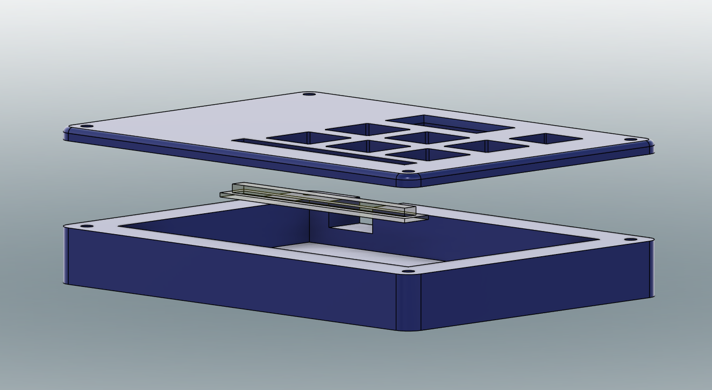

# My-Macropad
- A macropad that uses F13-19
- Has an RGB light bar.
- Has a display
- Has 6 keys and an rotary encoder

The body is in 3 parts, a lid, base and diffuser, The diffuser is meant to be printed in a clear material such as clear PETG. 

# BOM
| Part | Quantity |
| - | - |
| Seeed XIAO RP2040  | 1 |
| 1N4148 Diodes  | 7 |
| MX-Style switches  | 6 |
| EC11E Rotary encoders | 1 |
| 0.91 inch OLED display    | 1 |
| SK6812 MINI-E LEDs | 6 |
| DSA keycaps | 6 |
| M3x16mm screws | 4 |
| M3x5mx4mm heatset inserts | 4 |
